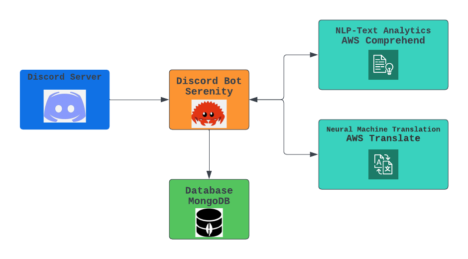

# Discord Emotion Tracker
- Discord Emotion Tracker is an application that collects messages from customer service channels on Discord, translates them from English to Korean using AWS Translate, and uses natural language processing techniques for sentiment analysis with AWS Comprehend. By processing these messages, the application can provide valuable insights into customer emotions and feedback.
- The application then stores the messages, translations, and sentiment analysis results in a MongoDB database.

## Features
- Collect messages from Discord channels using the Serenity library
- Send collected messages to AWS Comprehend for sentiment analysis
- Translate Discord messages from English to Korean using AWS Translate
- Store processed messages, translations, and sentiment analysis results in MongoDB
- Built using Rust, Serenity, AWS Comprehend, AWS Translate, and MongoDB
## Architecture Diagram


```
    discord-emotion-tracker/
    ├── Cargo.lock
    ├── Cargo.toml
    ├── Dockerfile
    ├── README.md
    ├── config.sample.yaml
    ├── config.yaml
    ├── emotion-tracker-diagram.png
    └── src
        ├── config.rs
        ├── discord.rs
        ├── main.rs
        ├── mongo.rs
        ├── monitor.rs
        ├── scheduler.rs
        ├── sentiment.rs
        ├── translate.rs
        └── util.rs
```

## Installation and Setup
1. Clone the repository:
    ```bash
    git clone https://github.com/augustine0890/discord-emotion-tracker.git
    ```
2. Change directory to the project folder:
    ```bash
    cd discord-emotion-tracker
    ```
3. Create a config.yaml file in the project root with the following content:
    ```yaml
    development:
        discord_token: YOUR_DEVELOPMENT_DISCORD_TOKEN
        mongo_uri: YOUR_DEVELOPMENT_MONGODB_URI

    production:
        discord_token: YOUR_PRODUCTION_DISCORD_TOKEN
        mongo_uri: YOUR_PRODUCTION_MONGODB_URI

    ```
4. Update the `config.yaml` file with your Discord token and MongoDB URI.

5. Build and run the project:

    ```bash
    cargo build --release
    cargo run --release
    ```
    and
    ```bash
    # Use production environment (default)
    ./target/release/discord-emotion-tracker

    # Use development environment
    APP_ENV=development ./target/release/discord-emotion-tracker
    ```

- Alternatively, you can run the application directly with `cargo run`:
    ```bash
    # Use production environment (default)
    cargo run

    # Use development environment
    APP_ENV=development cargo run

    ```

## Build Docker
- Build the Docker image
    - `docker build -t discord-emotion-tracker .`
- Run the Docker container
    - `docker run -d discord-emotion-tracker` --> run in background
    - `docker run --name discord-emotion-tracker -it --rm discord-emotion-tracker`
- Run the container in development enviroment
    - `docker run --env APP_ENV=development discord-emotion-tracker`
- Use sccache: sccache is a shared compilation cache that can help speed up Rust builds.
- Enable BuildKit by setting the environment variable:
    - `export DOCKER_BUILDKIT=1`
- Check the number of CPU cores on Ubuntu using: `lscpu | grep '^CPU(s):'`
- Build an image using the `Dockerfile.optimized`
    - `docker build -t discord-emotion-tracker -f Dockerfile.optimized .`
    - and run docker: `docker run -d discord-emotion-tracker`

## Usage
- Once the application is running, it will listen to messages from the configured Discord channels. Messages will be sent to AWS Comprehend for sentiment analysis and AWS Translate for English to Korean translation. The processed messages, translations, and sentiment analysis results will be stored in the MongoDB database.
## Contributing
We welcome contributions! If you'd like to help improve Discord Emotion Tracker, please follow these steps:

1. Fork the repository
2. Create a new branch with your changes
3. Submit a pull request to the main branch

## License
This project is licensed under the [MIT License](https://opensource.org/licenses/MIT).

## Acknowledgements
- [Rust](https://www.rust-lang.org/)
- [Serenity](https://github.com/serenity-rs/serenity): Discord API library
- [AWS Comprehend](https://docs.aws.amazon.com/comprehend/latest/dg/what-is.html): Natural Language Processing and Text Analytics
- [AWS Translate](https://aws.amazon.com/translate/): Fully managed neural machine translation service
- [MongoDB](https://www.mongodb.com/): A document database for storing messages, translations, and analysis results